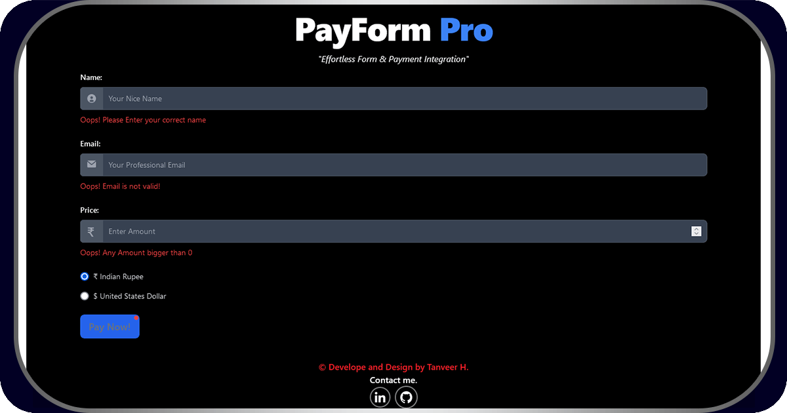

# Tanveer's PayForm Pro: Modular Razorpay Integration (Version 3.0)

PayForm Pro is a robust Next.js application that simplifies RazorPay integration, providing a seamless experience for form submissions and secure payment processing. This modular solution combines a user-friendly frontend, efficient backend API routes, and MangoDB data management to handle transaction entries effortlessly. Explore the power of modular RazorPay integration with PayForm Pro!

## Features

### 1. User-Friendly Form
Capture user input for Name, Email, Price, and Currency with a sleek and intuitive form component. Input fields are validated to ensure accurate data submission.

### 2. Data Storage with MongoDB
Transition from local JSON file storage to MongoDB for scalable and secure data management. This update improves data retrieval and storage efficiency.

### 3. Modular RazorPay Integration
Integrate seamlessly with Razorpay API for streamlined and secure payment processing. Handle both successful and failed payment scenarios, updating the UI based on payment status.

### 4. Razorpay Webhook Integration
Utilize Razorpay webhooks to verify transactions server-side, ensuring accurate and reliable payment verification.

### 5. Responsive UI
A responsive and dynamic user interface built with React and Tailwind CSS, ensuring an optimal viewing experience across devices.

### 6. Navigation Bar
Navigate easily with the new navigation bar featuring:
- **Home**: Access the main form page for transactions.
- **Dashboard**: View the 24-hour transaction history table.
- **Dev-Tools**: Check breakpoints, inspect hooks, and verify transactions.
- **APIs**: Access documentation pages and resources (PDFs, GitHub pages).
- **Hooks**: Access documentation pages and resources (PDFs, GitHub pages).

### 7. Dev-Tools / Test Page 
Explore the app's functionalities with a dedicated test page. Test different scenarios, including form submissions and payment processing, to ensure a smooth user experience.

### 8. Next.js API Routes
Efficient backend API routes built with Next.js to handle form submissions and payment processing seamlessly.

### 9. DDoS Protection
Implement protection to limit database access attempts to 7 times, preventing potential DDoS attacks and securing access.

## 10. Error Handling and Security
Implement robust error handling mechanisms for both the frontend and backend, providing intuitive error messages. Utilize different HTTP status codes such as 405 and 422 for specific scenarios. Ensure data validation and protect sensitive information, such as API keys. Log error messages to the console and display them appropriately on the user interface.

### 11. Performance Optimization
Optimize both frontend and backend code for efficiency, ensuring fast response times for form submissions and payment processing.

### 12. Scalability
Design the system to handle an increasing number of form submissions and payments, making it scalable for future enhancements and expansions.

## Technologies Used

- [React](https://reactjs.org/): A JavaScript library for building user interfaces. In PayForm Pro, React is used for creating a dynamic and interactive frontend, and it integrates seamlessly with the Next.js framework.

- [@reduxjs/toolkit](https://redux-toolkit.js.org/): The official, opinionated, batteries-included toolset for efficient Redux development. PayForm Pro utilizes Redux Toolkit for state management, making it easy to manage the application's global state.

- [RTK Query](https://redux-toolkit.js.org/rtk-query/overview): A powerful data fetching and state management library built on top of Redux Toolkit. PayForm Pro leverages RTK Query for handling API calls, providing a clean and efficient way to manage remote data.

- [Razorpay](https://razorpay.com/): A leading payment gateway platform. PayForm Pro integrates with Razorpay for secure and streamlined payment processing.

- [MongoDB](https://www.mongodb.com/): A NoSQL database for scalable and flexible data storage.

- [Shortid](https://www.npmjs.com/package/shortid): A simple, fast, and concise library for generating unique IDs. In PayForm Pro, Shortid is used for creating unique identifiers for receipts and orders.

- [Tailwind CSS](https://tailwindcss.com/): A utility-first CSS framework. Tailwind CSS is employed in PayForm Pro for building responsive and customizable user interfaces.

- [Crypto-js](https://crypto-js.googlecode.com/): A cryptographic library for JavaScript. PayForm Pro uses Crypto-js for secure data handling, particularly in payment-related processes.

- [@vercel/analytics](https://vercel.com/docs/analytics): Analytics powered by Vercel. This package is integrated for tracking and gaining insights into the application's usage.

- [@sentry/nextjs](https://docs.sentry.io/platforms/javascript/guides/nextjs/): An error tracking and performance monitoring tool. PayForm Pro integrates Sentry to capture errors and performance bottlenecks in both frontend and backend.

- [react-toastify](https://github.com/fkhadra/react-toastify): A library for displaying customizable toasts (notifications). PayForm Pro uses Toastify for showing user-friendly feedback messages throughout the application.

## Getting Started

To get started with PayForm Pro, follow these simple steps:

1. Clone the repository.
2. Install dependencies using `npm install`.
3. Run the application with `npm run dev`.

## Documentation

Explore our detailed documentation for in-depth insights into the API, hooks, and system architecture. Find it [here](./documentation).

## Live Demo

Check out the live demo [here](https://tanveer-payformpro.vercel.app) to experience PayForm Pro in action.

## Contribution

We welcome contributions! Fork the repository, make your enhancements, and submit a pull request. Let's build together!

## License

This project is licensed under the [Creative Commons Attribution-NonCommercial-ShareAlike 4.0 International License](http://creativecommons.org/licenses/by-nc-sa/4.0/).

## Contact

For any inquiries or feedback, feel free to reach out to me [here](https://tanveer-portfolio.vercel.app/en-US/contact).

---
**Thanks for exploring PayForm Pro! Happy coding!**
---

